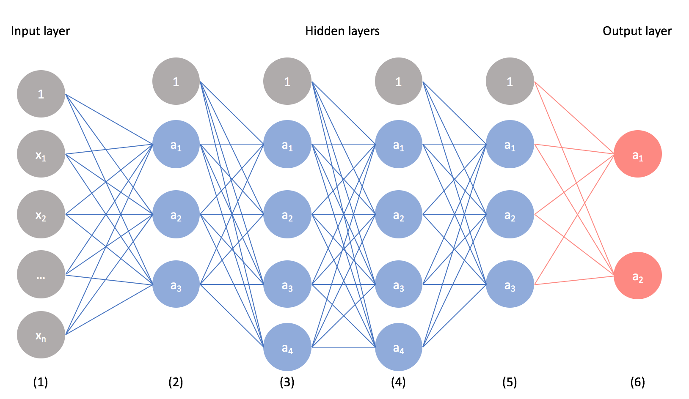

# SENIOR PROJECT : Neural Artistic Style Transfer
## NOTES
[<- main](./main.md)

This page contains notes on deep learning, linear regression, and every other possible thing related to neural networks. 

## Linear Regression

[Wiki](https://en.wikipedia.org/wiki/Linear_regression)
* [regression analysis](https://en.wikipedia.org/wiki/Regression_analysis) - set of statistical processes for estimting the relationships among variables
* regression function - function of the independent variables
* model the relationship between dependent and independent variables
* simple linear regression - 1 independent variable
* multiple linear regression - 2*
* modelled with linear predictor functions (linear models)- parameters are estimated from data

[linear regression -> deep learning](https://towardsdatascience.com/a-gentle-journey-from-linear-regression-to-neural-networks-68881590760e)
* neural networks belong to deep learning methods
* nn are highly parameterized complex functions that we try to optimise
* Basic Forward Neural network - multi payer perceptron
* Recurrent neural networks (rnn)
* convolutional neural networks (cnn)
* highly parameterized models great for big volumnes of data
* smart optimisation techniques + computing power = large scale models
* non-linearity of optimisation problem: randomly set initial weights of network and apply a gradient descent method over parameters to iteravily improve/reduce the error metric
* backpropagation - layer by layer gradient descent
* we backpropogate the derivatives computations in the network -> make optimization process more tractable

## Deep Learning and Neural Networks

Deep Learning is a more accurate, more intense type of machine learning. These systems are applied to fields like computer vision, speech recognition, natural language processing, etc.

[DNN rival the representation of primate it cortex for core visual object recognition](https://journals.plos.org/ploscompbiol/article?id=10.1371/journal.pcbi.1003963)

**Types of Neural Netorks**
* Convolutional NN -> image recognition
* long short-term memory network -> speech recognition

[Deep Learning Wiki](https://en.wikipedia.org/wiki/Deep_learning)
* inspired by info processing and communication patterns in biological nervous systems
* class of machine learning algorithsm
* use a cascade of multiple layers of nonlinear processing units for feature extraction and transformation
* each layer uses the output from the previous layer as output
* most models based on artificial neural network
* image = matrix of pizels
* deep = multiple layers of data tranformation
* CAP (credit assignment path) depth : chain of transformations from input to output
* greedy algorithm

["A Beginner's Guide to Neural Networks and Deep Learning"](https://skymind.ai/wiki/neural-network)
* Neural networks are a set of algorithms designed to recognize patterns. They mimick the human brain. 
* patterns of images, sound, time, etc - numerical (contained in vecotrs)
* Deep learning - "stacked neural networks" - networks composed of several layers
- layers are made of nodes - like a brain neuron
- nodes take input data and assign signifigance
- input layer, hidden layer, output layer

[Neural Networks Explained](https://www.youtube.com/watch?v=GvQwE2OhL8I)
* (Khan academy) - using feed forward neural network with back propagation
* layer 1 = # input dimensions
* layer(s) = hidden layers
* layer 3 = # output dimensions
* "Black Box" Configuration
    * usualy 1 hidden layer
    * # nodes in each hidden layer < 2x input nodes
    * activation function & biases
    * learning rate & momentum
    * iterations or desired error level
* !!!!trying to find relationships between non-linear data
* How it goes
    1.  get the inputs
    2.  multiply sums by random weights and what not
    3.  run it through activation function
    4.  get the outputs
    5.  calculate error
    6.  backpropoagation - go backwards, adjusting weights and biases
    7.  reiterate
* How to determine how much to change in a given bias
    * learning rate - how much should this step outcome affect our weights & biases?
    * momentum - how should past outcomes affect weights & biases
    * change = (learning rate * delta * value) + (momentum * pastChange)

[But What *is* a neural network?](https://www.youtube.com/watch?v=aircAruvnKk)
* multilayer perceptron
* neural network is a giant function (input->output)
    * neuron = node : holds a (activation) number
    * layer of neurons
* how does activation in one layer affect the next?
* "learning" -> finding the right weights and biases
* a0 = sigmoid(w weight matrix * a1 activation layer/vectors + b) - transition of activations from one layer to the next using matrix multiplication 

[Gradient Descent - how nn learn](https://www.youtube.com/watch?v=IHZwWFHWa-w)
* network learning = minimizing a cost function
* each neuron is connected to the ones in the previous layer
    *  sigmoid((w1a1)+(w2a2)+...+(wnan)+b) = c
    *  w = weights, a = activation of a node, b = bias
    *  w*a = strengths of their connection
    *  b = tendency of neuron to be active/inactive
* initial weights are randomly assigned
* finding the minimum of non-linear function
    * capture the derivative or slope of tangent
    * positive -> shift left or negative -> shift right
    * find local minimum depending on input 
    *  for multivariate inputs
        * gradient -> direction of steepest descent
* acitvations of neurons are constantly altered
* cost = sum of (actual-expected)^2 in the output layer
    * sum of costs over all iterations is the totla cost
    * some relationships cause greater changes to the cost
* gradient descent - repeatedly nudging an input of a function by multiple of negative gradient to converge toward a local minimum of a cost function - find the valleys 

[Back Propogation](https://www.youtube.com/watch?v=Ilg3gGewQ5U)
* "Neurons that fire together wire together" - Hebbian Theory
    * biggest increases to weights bw most active neurons and what we want the next neuron to be
* a neuron's activation = weighted sum of all activations of previous layer + bias inside sigmoid squish function
    * increasing an activation 
        * increase bias
        * increase weights in proportion to activations
        * change activation in proportion to weights (but we have less control over these)

## Convolutional Neural Networks (CNN)
[CNN for Visual Recognition](http://cs231n.github.io/convolutional-networks/)

* CNN architectures assume that inputs are images 
* 3D volumes of neurons 
* A **ConvNet** is made of layers - each a simple api that transforms an input 3D volume to an output 3D volume with some differentiable function that may or may not have parameters 

### ConvNet Layers
* example architecture (layers)
    * _dimension [axbxc]_: a= width, b=height, c=RGB color channels
    * _INPUT_: holds raw pixels of image
    * _CONV_: compute (dot product) output of neurons connected to input
    * _RELU_: apply activation functions like max(0,x)
    * _POOL_: downsampling operation along spatial dimensions
    * _FC_: computer class scores
* transform original image layer by layer from original pixel values to the final class cores

#### Convolutional Layer
* core building block of CNN - does computational heavy lifting
* set of learnable filters 
* apply filter at input of every position (wXh)
* _logical connectivity_: each neuron connects to neuron in a local region of input volume
    * _receptive field_: filter size or spatial extent of connectivity
* **spatial arrangement of the output volume** 
    * _depth_: # of filters wed like to use
        * _depth column_ or fibre, set of neuron looking at the same region
    * _stride_: 1 - slide filters one pixel one at a time (or 2-2 at a time)
    * _zero-padding_: put input volume with zeroes around border -> help control spatial size of output volumes
* **parameter sharing scheme** control the number of parameters
    * assumption - if one feature is useful to compute at position (x,y), then it should also be useful to computer at position (x1,y1)
* **depth slice** getting single 2D slices of depth 
    * ex) cnn of [5x5x2] has 2 slices of [5x5]
    * constrain neurons of each slice to use the same weights and bias
* **locally-connected layer**: certain images (like faces) have featuresthat should be learned in different spatial locaations and not use parameter sharing
* **OVERALL**
    * accept volume wxhxd
    * require hyperparameters (k filters, f spatial extent, s stride, p zeropadding)
    * product volume w2xh2xd2
        * w2 = (w1-F + 2P)/S + 1
        * h2 = (h1-F+2P)/S+1
        * d2 = k
    * common setting: f=3, s=1, p=1

#### Pooling Layer
* periodically insert a pooling layer between successive conv layers
* progressively reduce the spatial size of the representation to reduce the amount of paramters and computation in the network - control overfitting
* max pool
* some can get away without this layer

#### (FC) Fully-Connected layer
* neurons have full connections to all activations in previous layer (regular nn)

#### ConvNet Architectures
* _when in doubt, use whatever works best on image net - download a pretrained model and finetune it on your data_* 
#### Layer Patterns
* INPUT->[[CONV->RELU]*N->POOL?]*M->[FC->RELU]*K->FC
    * stacks CONV-RELU layers + POOL layers and repat until image is spatially smaller
    * then transition to FC layers -> output/clas scores
* or Prefer a stack of small filter conv to one large receptive conv layer 

## Neural Style

[A Neural Algorithm of Artistic Style](https://arxiv.org/abs/1508.06576) 

* Convolutional Neural Networks
    * each layer of units are a collection of image filters that extract a certain feature from the input image
    * outputare differently filtered versions of the image
    * during image recognition processing hiearchy : pixel values -> object content
* content representation - feature responses in higher layers of network
    * reconstructions of lower layers produce pixels
* style representation
    * Getting the style with a feature space
* **representations of content & style in CNN are separable**
    * we can manipulate them independently to produce new images
    * with the content of one images and the style of another
    * in certain cases, emphasize style or content 
* used feature space provided by VGG-Network, master CNN
* image synthesis - avg pooling > max pooling visually

